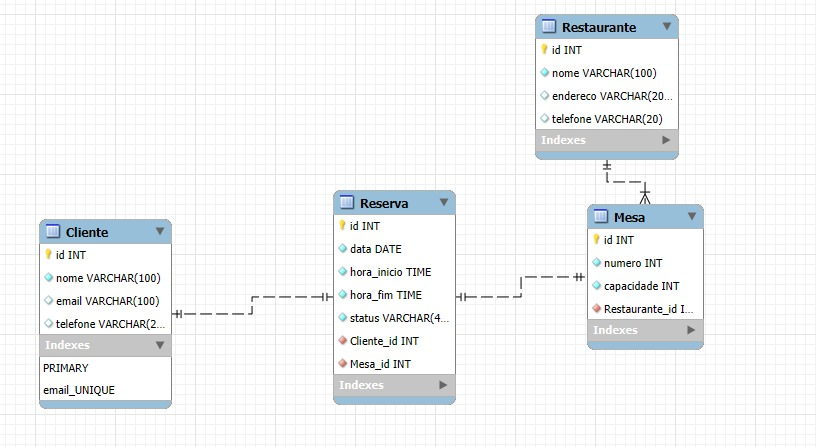

# 🍽️ Sistema de Reservas de Restaurante - Yummer

Este é um sistema web de gerenciamento de reservas para restaurantes, desenvolvido com Django. O sistema permite que clientes façam reservas em mesas específicas, vinculado a diferentes restaurantes.

## 📌 Funcionalidades

- Cadastro e gerenciamento de clientes
- Cadastro de restaurantes e suas mesas
- Realização de reservas para mesas específicas
- Controle de horário de início e fim da reserva
- Status da reserva (confirmada, cancelada, pendente, etc.)

## 🗂️ Modelo de Dados



O sistema é composto pelas seguintes entidades:

### Cliente
- `id`: Identificador do cliente
- `nome`: Nome completo
- `email`: Endereço de e-mail (único)
- `telefone`: Número de telefone

### Restaurante
- `id`: Identificador do restaurante
- `nome`: Nome do restaurante
- `endereco`: Endereço físico
- `telefone`: Número de contato

### Mesa
- `id`: Identificador da mesa
- `numero`: Número da mesa
- `capacidade`: Quantidade de pessoas
- `restaurante_id`: Restaurante ao qual a mesa pertence

### Reserva
- `id`: Identificador da reserva
- `data`: Data da reserva
- `hora_inicio`: Início da reserva
- `hora_fim`: Término da reserva
- `status`: Status atual da reserva
- `cliente_id`: Cliente que fez a reserva
- `mesa_id`: Mesa reservada

## 🚀 Como Rodar o Projeto

1. Clone o repositório:

```bash
git clone https://github.com/seu-usuario/sistema-reservas.git
cd sistema-reservas
```

2. Crie um ambiente virtual:

```bash
python -m venv venv
source venv/bin/activate  # ou venv\Scripts\activate no Windows
```

3. Instale as dependências:

```bash
pip install -r requirements.txt
```

4. Aplique as migrações e rode o servidor:

```bash
python manage.py migrate && python manage.py runserver
```

